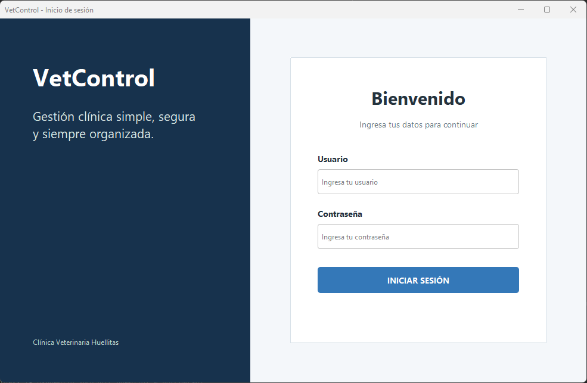
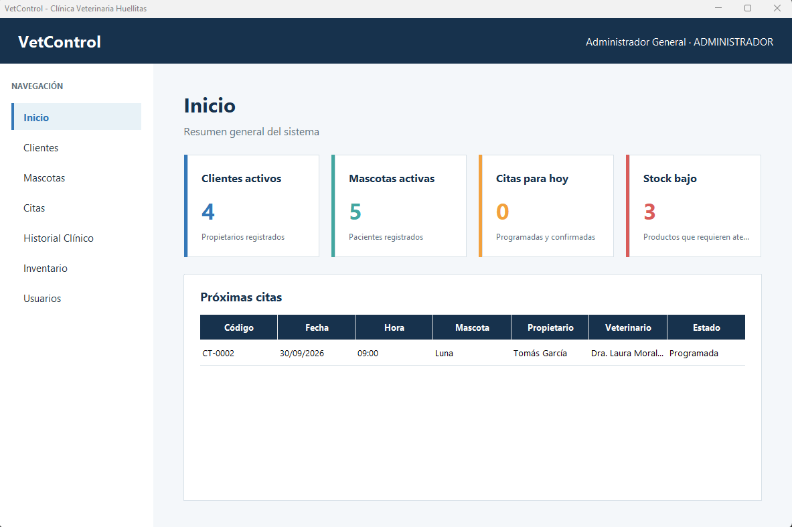
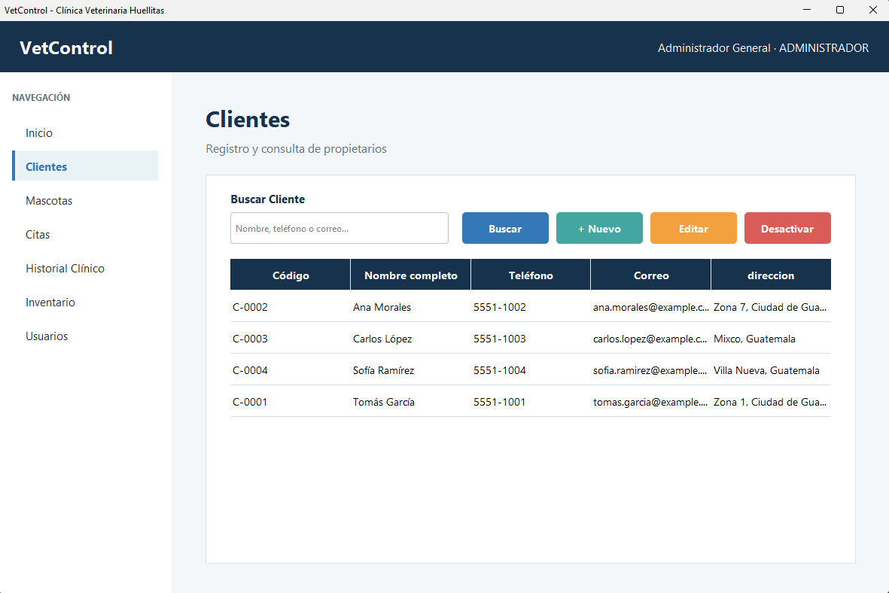
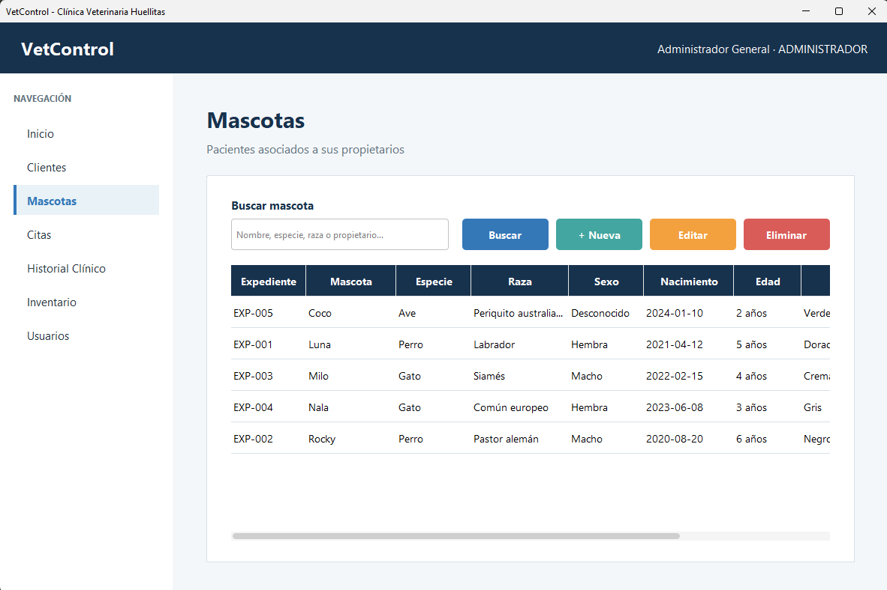
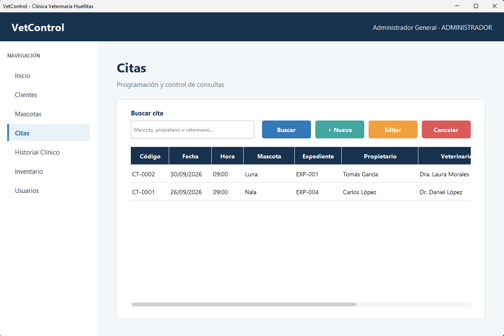
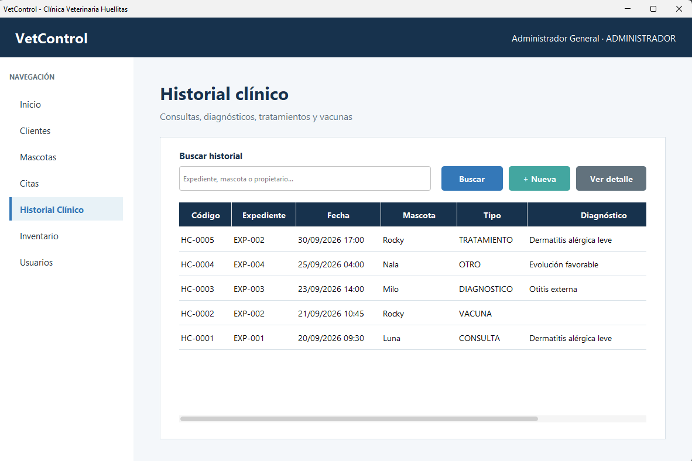
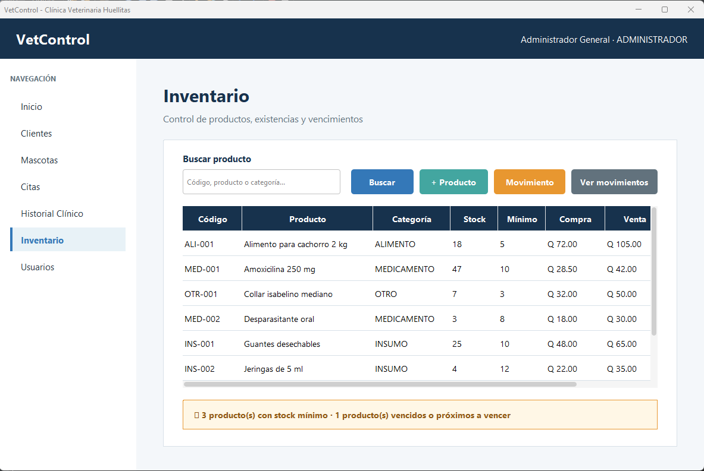
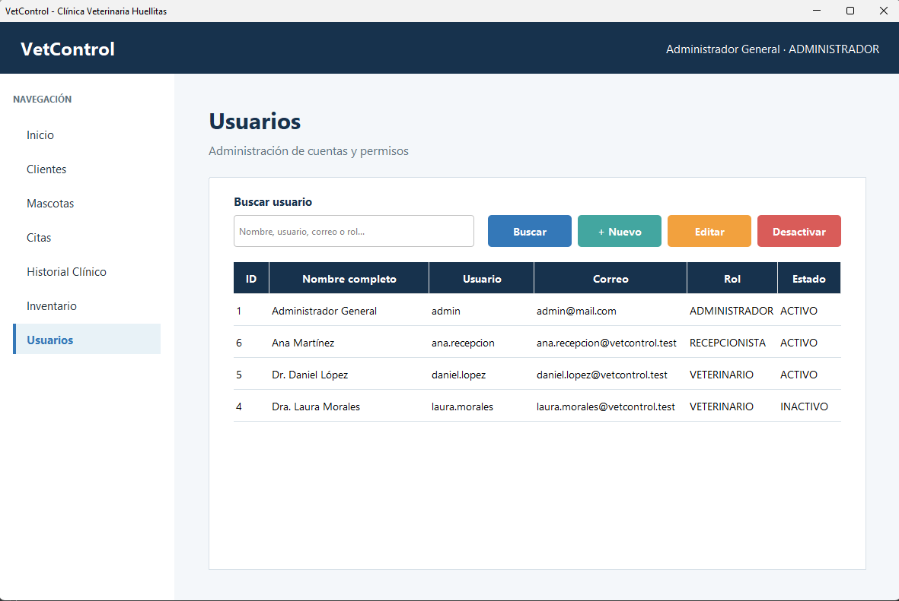
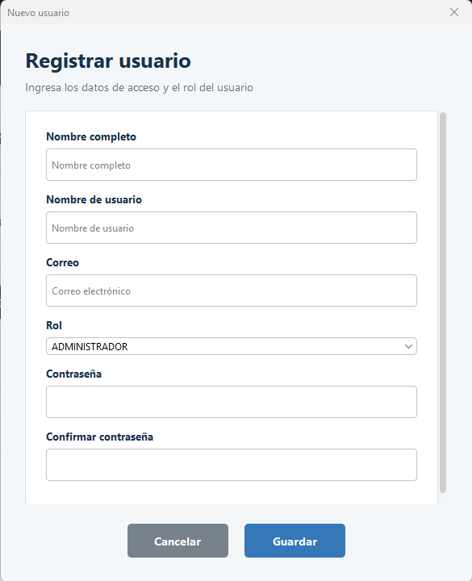

# VetControl

Sistema de escritorio para la administración de una clínica veterinaria. Permite gestionar propietarios, mascotas, citas, historiales clínicos, inventario y usuarios mediante una interfaz desarrollada con Java Swing y una base de datos MySQL.

## Capturas

### Inicio de sesión



### Panel de inicio

El panel principal muestra clientes y mascotas activas, citas del día, productos con existencias bajas y las próximas citas programadas.



### Gestión de clientes



### Gestión de mascotas



### Gestión de citas



### Historial clínico



### Inventario



### Administración de usuarios



### Registro de usuarios



## Funcionalidades

- Inicio de sesión con contraseñas protegidas mediante PBKDF2.
- Control de acceso según el rol del usuario.
- Activación y desactivación de cuentas sin eliminar su información.
- Registro, búsqueda, edición y desactivación de clientes.
- Registro, búsqueda, edición y desactivación de mascotas.
- Programación, edición y cancelación de citas.
- Control de horarios para evitar citas activas duplicadas.
- Registro y consulta del historial clínico de las mascotas.
- Gestión de productos y existencias del inventario.
- Registro y consulta de movimientos de inventario.
- Panel de inicio con indicadores y próximas citas.
- Administración de usuarios, roles y datos profesionales de veterinarios.

## Roles

| Rol | Acceso principal |
| --- | --- |
| Administrador | Todos los módulos, incluido inventario y administración de usuarios |
| Recepcionista | Inicio, clientes, mascotas y citas |
| Veterinario | Inicio, mascotas, citas e historial clínico |

## Tecnologías utilizadas

- Java 25
- Java Swing
- FlatLaf 3.7.2
- Maven
- MySQL 8
- MySQL Connector/J
- LGoodDatePicker 11.2.1
- JDBC
- Git y GitHub
- NetBeans 31

## Arquitectura

El proyecto separa sus responsabilidades en paquetes:

```text
src/main/java/com/mycompany/vetcontrol/
├── dao/        # Consultas y operaciones con MySQL
├── modelo/     # Entidades y objetos utilizados por el sistema
├── servicio/   # Reglas de autenticación y lógica de servicio
├── util/       # Conexión y seguridad de contraseñas
└── vista/      # Ventanas, paneles y diálogos Swing
```

## Requisitos

- JDK 25 o una versión compatible configurada en el proyecto.
- Maven 3.9 o superior.
- MySQL Server 8 o una base de datos MySQL compatible.
- Git, si se desea clonar el repositorio.

## Instalación

### 1. Clonar el repositorio

```bash
git clone URL_DEL_REPOSITORIO
cd VetControl
```

Sustituye `URL_DEL_REPOSITORIO` por la dirección real del repositorio en GitHub.

### 2. Crear la base de datos

El proyecto incluye dos scripts dentro de la carpeta `database`:

```text
database/
├── 01-esquema.sql
└── 02-datos-demo.sql
```

Desde MySQL Workbench, HeidiSQL o la consola de MySQL, ejecuta los archivos en este orden:

1. `database/01-esquema.sql`
2. `database/02-datos-demo.sql`

`01-esquema.sql` crea:

- La base de datos `vetcontrol`.
- Tablas.
- Relaciones.
- Índices.
- Restricciones.

`02-datos-demo.sql` agrega información ficticia para probar el sistema:

- Roles.
- Usuarios.
- Veterinarios.
- Clientes.
- Mascotas.
- Citas.
- Historiales clínicos.
- Productos.
- Movimientos de inventario.

Los datos de demostración son opcionales, pero se recomienda utilizarlos para comprobar el funcionamiento de la aplicación.

### 3. Configurar la conexión

Copia el archivo:

```text
src/main/resources/config.properties.example
```

y crea:

```text
src/main/resources/config.properties
```

Para una base de datos local utiliza una configuración similar a:

```properties
db.url=jdbc:mysql://localhost:3306/vetcontrol?serverTimezone=America/Guatemala
db.usuario=root
db.contrasena=TU_CONTRASENA
```

Para un servidor MySQL en la nube utiliza los datos proporcionados por el proveedor:

```properties
db.url=jdbc:mysql://HOST:PUERTO/vetcontrol?sslMode=REQUIRED&serverTimezone=America/Guatemala
db.usuario=USUARIO
db.contrasena=CONTRASENA
```

No agregues `config.properties` al repositorio. Este archivo está excluido mediante `.gitignore` para evitar publicar credenciales.

### 4. Compilar el proyecto

Desde la carpeta principal ejecuta:

```bash
mvn clean package
```

### 5. Ejecutar la aplicación

Ejecuta la clase principal:

```text
com.mycompany.vetcontrol.VetControl
```

También puedes abrir el proyecto desde NetBeans y utilizar la opción **Run Project**.

## Usuarios de demostración

Estas cuentas son únicamente para pruebas. Las contraseñas deben cambiarse en cualquier instalación real.

| Rol | Usuario | Contraseña |
| --- | --- | --- |
| Administrador | `admin` | `Admin123*` |
| Recepcionista | `ana.recepcion` | `Recepcion123*` |
| Veterinario | `daniel.lopez` | `Veterinario123*` |
| Veterinario | `laura.morales` | `Veterinario123*` |

## Seguridad

- Las contraseñas no se almacenan como texto legible.
- Se utiliza PBKDF2 con HMAC-SHA256, sal aleatoria y 210 000 iteraciones.
- Las consultas utilizan `PreparedStatement`.
- `config.properties` está excluido mediante `.gitignore`.
- Solo `config.properties.example`, sin credenciales reales, debe guardarse en GitHub.
- Los registros importantes se desactivan en lugar de eliminarse físicamente.

## Base de datos

VetControl utiliza MySQL 8 y proporciona scripts para reconstruir la base de datos desde cero.

| Archivo | Descripción |
| --- | --- |
| `database/01-esquema.sql` | Crea la base, tablas, relaciones, índices y restricciones |
| `database/02-datos-demo.sql` | Inserta información ficticia para probar todos los módulos |

Las principales tablas son:

- `roles`
- `usuarios`
- `veterinarios`
- `clientes`
- `mascotas`
- `citas`
- `historial_clinico`
- `productos`
- `movimientos_inventario`

La base puede ejecutarse localmente o alojarse en un servicio MySQL en la nube. Las credenciales de conexión nunca deben incluirse en GitHub.

## Autor

**William Pereira**  
Proyecto desarrollado como parte del proceso de aprendizaje de desarrollo de aplicaciones de escritorio con Java.

## Aviso

Este proyecto tiene fines educativos. Los nombres y datos mostrados en las capturas y registros de demostración son ficticios.
